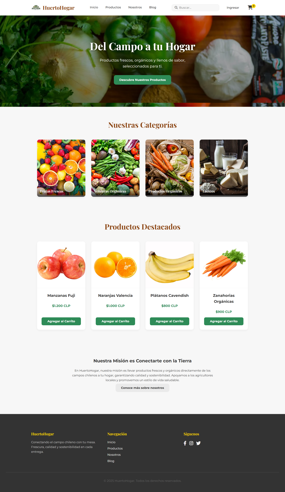
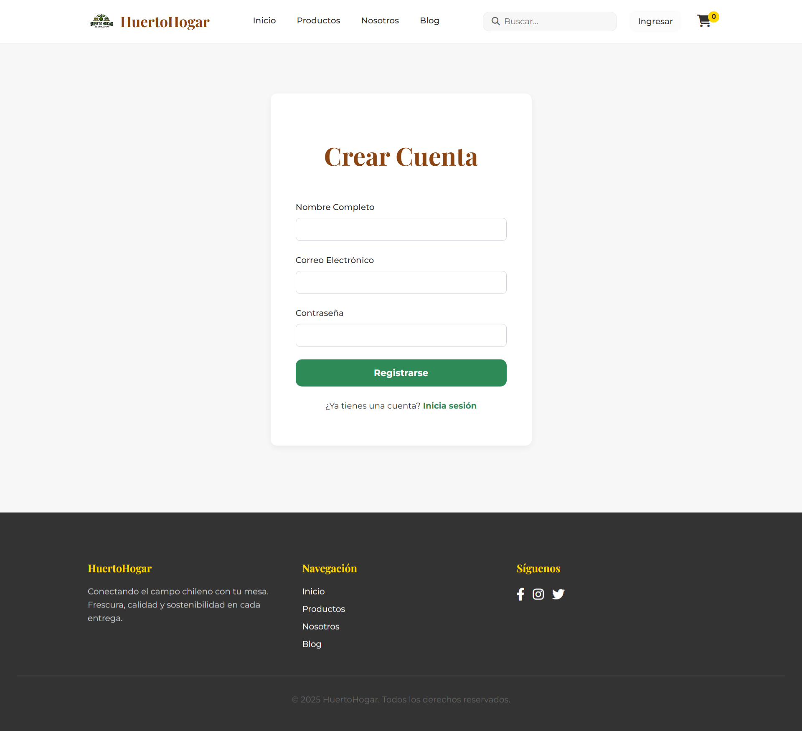
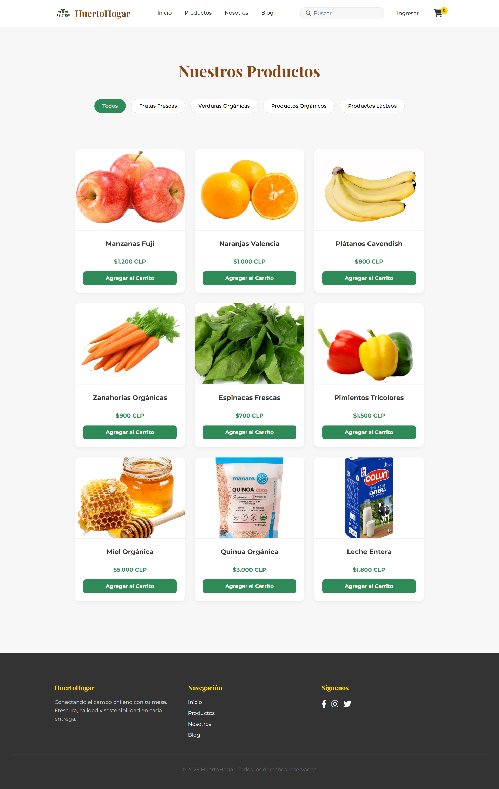

# 🥑 HuertoHogar - Tienda Online de Productos Frescos


**HuertoHogar** es una tienda online dedicada a llevar la frescura y calidad de los productos del campo directamente a la puerta de nuestros clientes en Chile. Con más de 6 años de experiencia y presencia en 9 ciudades, promovemos un estilo de vida saludable y sostenible.

---

## 🌱 Misión

Proporcionar productos frescos y de calidad directamente desde el campo hasta la puerta de nuestros clientes, fomentando la conexión entre consumidores y agricultores locales, y promoviendo prácticas agrícolas sostenibles.

## 👁️ Visión

Ser la tienda online líder en la distribución de productos frescos y naturales en Chile, reconocida por nuestra calidad, servicio y compromiso con la sostenibilidad.

---

## 🚀 Características principales

- Registro y autenticación de usuarios
- Gestión de perfiles y direcciones de entrega
- Catálogo de productos con filtros por categoría
- Carrito de compras y resumen de pedidos
- Seguimiento de pedidos y envíos
- Reseñas y calificaciones de productos
- Blog educativo sobre alimentación saludable y sostenibilidad
- Programas de fidelización y descuentos
- Integración con redes sociales
- Mapa de tiendas físicas

---

## 🖼️ Capturas de pantalla

### Página principal


### Registro de usuario


### Catálogo de productos


## 🛠️ Tecnologías utilizadas

- HTML5, CSS3, JavaScript
- Google Fonts: Montserrat, Playfair Display
- Font Awesome

---

## 📦 Estructura del proyecto

```
/assets
  /css
  /img
  /js
index.html
registro.html
productos.html
nosotros.html
blog.html
README.md
LICENSE
.gitignore
```

---

## 📋 Instalación y uso

1. Clona el repositorio:
   ```
   git clone https://github.com/Nachovn12/huertohogar-tienda-grupo5.git
   ```
2. Abre la carpeta en tu editor favorito (recomendado: VS Code).
3. Abre `index.html` en tu navegador.

---

## 📍 Sucursales

- Santiago
- Puerto Montt
- Villarica
- Nacimiento
- Viña del Mar
- Valparaíso
- Concepción

---

## 👥 Contribuidores

- Ignacio [Nachovn12](https://github.com/Nachovn12)
- Benjamin [BenjaFlores379](https://github.com/BenjaFlores379)

---

## 📄 Licencia

Este proyecto está bajo la licencia MIT.

---

> ¡Descubre la frescura del campo con HuertoHogar!  
> Conéctate con la naturaleza y lleva lo mejor del campo a tu mesa.
